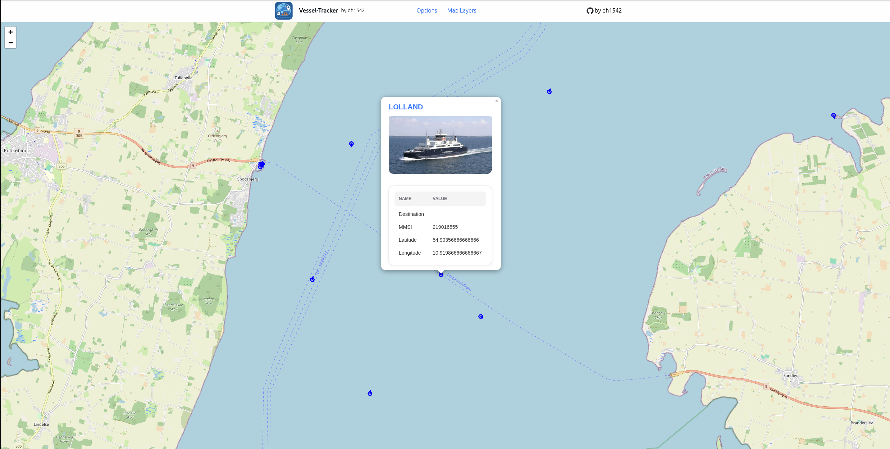

# Vessel-Tracker
The Vessel-Tracker is a service that uses the free AIS stream web socket (https://aisstream.io/) to fetch position data of
ships and provides visual representation on a map. 

## Showcase

## Architecture

            +-----------------------+
            |   AIS Stream (WS)     | (Global Firehose)
            +----------+------------+
                       |
                       v
            +----------+------------+
            |   Ingestion Service   | 
            |  - Connects to WS     |
            |  - Parses messages    | GO
            |  - Stores in DB       |
            |  - Scrapes for image  |
            +----------+------------+
                       |
                       v
            +----------+------------+
            |   PostgreSQL          | 
            +----------+------------+
                       |
                       v
            +----------+------------+
            |   REST API Service    | 
            |  - Handles HTTP GET   | GO
            |  - Queries DB by FOV  |
            +----------+------------+
                       |
                       v
            +----------+------------+
            |   React Frontend      |
            |  - Polls /api/position| REACT
            |  - params: bbox       |
            +-----------------------+

## How to deploy

### Prerequisites

- Docker
- Minikube
- go
- react

### Install PostgreSQL with Helm
kubectl apply -f deployment/namespace.yaml

helm repo add bitnami https://charts.bitnami.com/bitnami
helm repo update

helm install postgres bitnami/postgresql \
  -n postgres \
  -f databases/postgres/postgres-values.yaml

